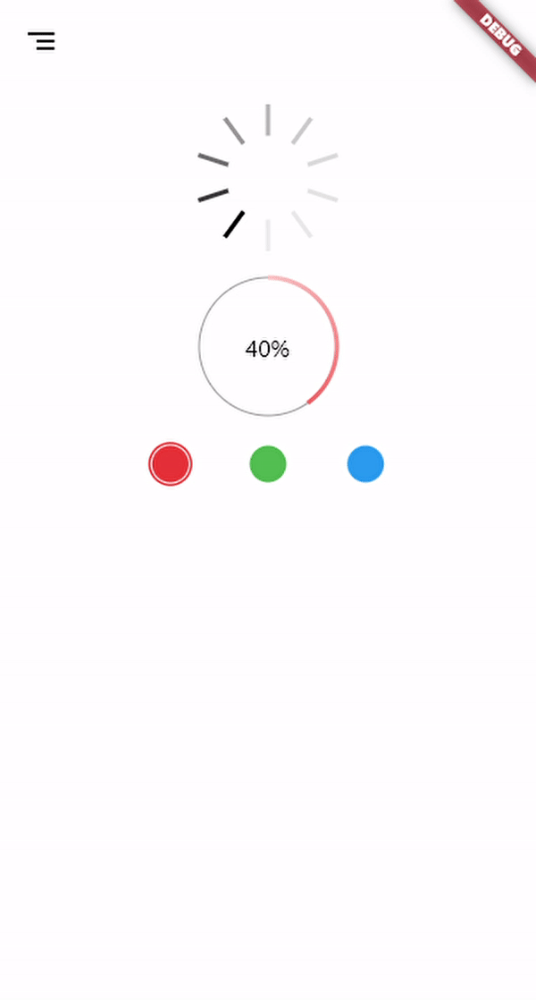

# custom_widgets

Some custom widgets created from scratch and highly customizable (cause some of them are drawn on canvas), to be reused in other projects. Free to use.

- ```/lib/painted_widgets``` are widgets drawn on canvas with CustomPainter.

- ```/lib/widgets``` are some widgets using or not the painted ones.

Just run the project to see the widgets in action.

